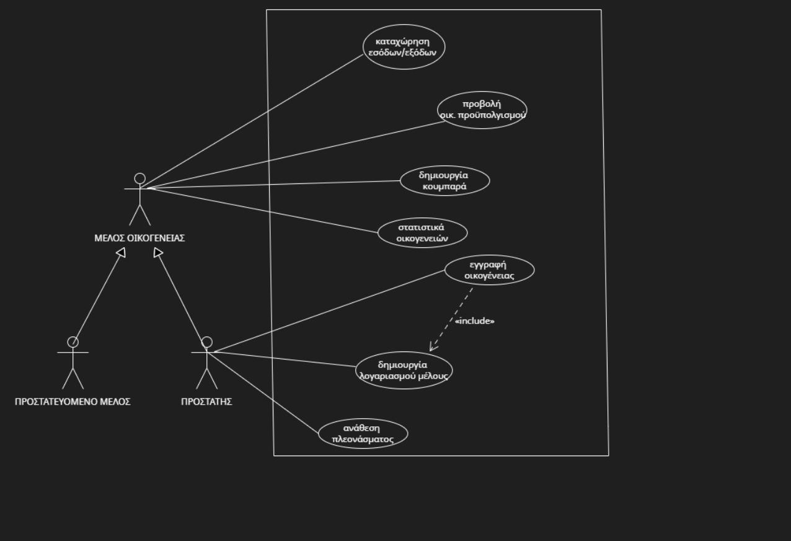

## Family Budget Management Application

In the modern era, the optimal management of a family's financial resources is a critical issue. Therefore, the development of supporting software is essential.

Such an application should provide a holistic view of the family's finances, allowing participation from every member through the entry of income/expenses and the creation of financial goals. Additionally, it should offer rich information about the family budget and access to statistical reports.

## Software Requirements

**Functional Requirements:**

---

1. Record and group recurring (fixed) expenses.
2. Record monthly income.
3. Calculate available income.
4. Calculate loan installments and financial burden.
5. Register a family through a guardian member.
6. Allow the guardian to create accounts for each family member.
7. Enable all members to participate in managing the family budget.
8. Allow each member to enter extraordinary income/expenses.
9. Categorize income and expenses.
10. Display family budget data to all members.
11. Allow creation of savings goals (piggy bank) by any member.
12. Allow the guardian to allocate part of the surplus to a piggy bank.
13. Record monthly savings.
14. Display statistical reports about the family budget.

---

[**Non-Functional Requirements**](docs/markdown/non-functional.md)

---

1. Fast response time to user requests.
2. Intuitive and user-friendly interface.
3. Protection of personal data against breaches.
4. Application availability at all times.
5. Rapid debugging and issue resolution.
6. Access to the application regardless of platform or OS.

---

## Use Case Diagram

[You can also find this diagram here](docs/uml/requirements/use-case-diagram.png)

---

## Use Case Descriptions

[**UC 1. Record Income/Expenses**](docs/markdown/use_case_kataxwrish.md)  
Core functionality allowing users to record income/expenses and categorize them by frequency and origin. Entries can be recurring or one-time.  
- Recurring: salary, rent (income); mobile bill, subscriptions (expenses)  
- One-time: selling a PC (income); car repair (expense)  
All entries are classified into categories (e.g. salaries, utilities, rent).  
[Activity diagram](docs/markdown/uml/requirements/activity_register_income.uxf)  
[Sequence diagram](docs/uml/requirements/sequence-register-income.png)

---

[**UC 2. View Family Budget**](docs/markdown/use_case_probolh_budget.md)  
All family members can view the total family income/expenses and their own. They can sort budget views by time (weekly, monthly, yearly).  
[Activity diagram](docs/markdown/uml/requirements/activity_balance.uxf)  
[Sequence diagram](docs/uml/requirements/family_budget.PNG)

---

[**UC 3. Create Family Member Accounts**](docs/markdown/create_account.md)  
The guardian is the administrator responsible for creating user accounts for family members.  
[Activity diagram](docs/markdown/uml/requirements/activity_create_account.uxf)  
[Sequence diagram](docs/uml/requirements/create_member.PNG)

---

[**UC 4. Register Family**](docs/markdown/eggrafh_oikogeneias.md)  
The guardian can register the family in the service by creating a family profile and an administrator account.  
[Activity diagram](docs/markdown/uml/requirements/activity_register_family.uxf)  
[Sequence diagram](docs/uml/requirements/register_fam.PNG)

---

[**UC 5. Create Piggy Bank**](docs/markdown/CREATE_PIGGYBANK.md)  
Each member can create one or more piggy banks to save a defined amount toward a financial goal.  
[Activity diagram](docs/markdown/uml/requirements/activity_piggybank.uxf)  
[Sequence diagram](docs/uml/requirements/sequence-create-piggy-bank.uxf)

---

[**UC 6. Allocate Surplus to Piggy Bank**](docs/markdown/ana8esh_pleonasmatos.md)  
At the end of each month, the guardian can allocate part or all of the surplus to a piggy bank of their choice.  
[Sequence diagram](docs/uml/SequenceAllocateDisposable.png)

---

[**UC 7. View Family Statistics**](docs/markdown/probolh-statistikwn.md)  
All members can view general statistics about the financial status of other families (e.g. percentage with deficit, percentage saving more than €1000 per year) as well as their own personal statistics.

---

## ASSUMPTIONS

1. Savings are recorded on the first day of each month. Any deficit reduces total savings.
2. Expenses that concern the whole family are considered to belong to the guardian.

---

[**Domain Model**](docs/uml/requirements/analysis-classes.uxf)

---

## Static View of Logic

[Static view .png](docs/uml/requirements/static_logic.PNG)

---

## Code Coverage

[Code coverage PNG](docs/uml/requirements/coverage.png)
